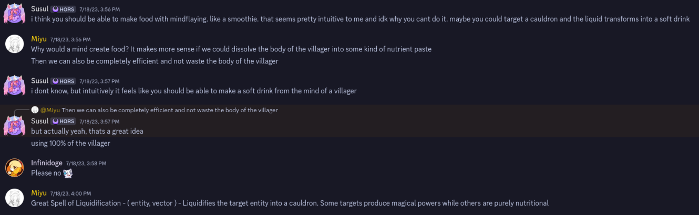

#+TITLE: Hex Addon Planning
#+AUTHOR: poolcritter
#+OPTIONS: \n:t

* Projects
** [[https://modrinth.com/mod/hexic][Hexic]]
pile of old ideas, deprecated and ripe for theft
*** TODO finish enumerating features
:LOGBOOK:
CLOCK: [2026-01-08 Thu 13:25]--[2026-01-08 Thu 13:26] =>  0:01
CLOCK: [2026-01-08 Thu 13:03]--[2026-01-08 Thu 13:19] =>  0:16
:END:
if any of y'all people want to steal this, ping me so I can remove it from the list

- [X] [[./project/iotaworks/][patchworks]]
- [X] [[./project/hexxytounge][murmur refl]]
- [X] [[./project/hexxytounge/][greater reveal]]
- [ ] mediaweave
  - [ ] wool edification
  - [ ] messaging frames (for mediaweave)
- [ ] stringworms
  - [ ] shimmering stringworms
- [ ] stream iotas
- [ ] pattern remapping (modpacks)
- [ ] pens
- [ ] media pouches
- [ ] NBT iotas
- [ ] tripwire iotas (unimplemented)
- [ ] media chiseling
- [ ] (+hexical) hopper into/out of conduits
- [ ] (+hexical) Apply Pigment pattern
  - [ ] works on trinkets
- [ ] list manipulation patterns (where, take, rotate, drop, grep, extract)
- [ ] modulo 2
- [ ] vulpine gambit
- [ ] tupling exaltations
- [ ] snow pattern
- [ ] lani gambits
- [ ] dual's reflection
- [X] [[https://github.com/object-Object/IoticBlocks][erase block/entity]]
- [ ] pseudothoth
- [ ] echo shard casting
- [ ] item overstacking
*** TODO give chisels a texture
*** TODO special demiplane NG handling
when entering, always enter at the center
when exiting, exit where you last entered from
or get sent to the deep noo
*** TODO give tables a model in-inventory
*** TODO crafted amethyst
created by a table; worth a shard
need to implement texture generation
can be charmed; breaks if discharmed
*** TODO document undocumented patterns
- [X] demiplane patterns
- [ ] conjure snow
- [ ] pseudothoth
** [[https://modrinth.com/mod/phlib][PHLib]]
*** TODO [#A] make a mod icon
probably my player head holding a quenched amethyst
*** TODO reimplement Flock Decomp on maps
*** TODO phlib ↔ [[https://modrinth.com/mod/hexthings][hexthings]] map conversion
*** TODO dialect conversion in general, actually
** Underevaluate
*** TODO create project
it needs a real name
*** TODO Hermes' Gambling
*** TODO find other scrapped ideas
executes given iota with a 25% chance, <ne,qqqeeaqq>
** [[https://modrinth.com/mod/iotaworks][Iotaworks]]
*** TODO finish implementing subscripts
*** TODO implement patchwork subscripts
** HexxyChests
*** TODO make sure everything works
*** TODO make todo list
** HexxyTongue
*** TODO port mediaweaves
*** TODO channeled reveal
maybe revealing a map merges it with an internal 'channel' map?
** IoticIotas
*** TODO revisit
does this still exist? is it still worth it?
** [[https://modrinth.com/mod/ducky-periphs][Ducky Peripherals]]
*** TODO iota type support
- [ ] maps
- [ ] hexthings maps
- [ ] tripwires
** [[https://modrinth.com/mod/ioticblocks][IoticBlocks]] (external)
*** TODO Erase Block
** [[https://modrinth.com/mod/hexweb][HexWeb]] (external)
*** TODO get Gradle dependency working
techtastic mentioned 'weird scala stuff' which might be my fault it's probably my fault it's always my fault anyways it needs to be fixed
* Ideas
** TODO Spellminds
effectively cross-server cross-instance iota transfer bound permanenently to one specific player
might have special behavior for some iota types; other types of iotas are either unmodified or blacklisted
we need iota fmapping though
** TODO Liquidification greatspell

